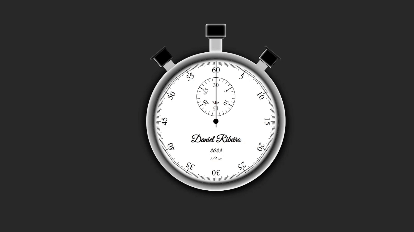

# Interactive Analog Clock

## Overview

This project features an interactive analog clock created using HTML, CSS, and JavaScript. The clock has three hands (milliseconds, seconds, and minutes) and provides functionalities to start, stop, and reset the time.

## Directory Structure

The project's directory structure is as follows:

- `index.html`: The HTML file that defines the clock's page structure.
- `style.css`: The CSS file that styles the clock.
- `script.js`: The JavaScript file that controls the clock's functionalities.

## Features

The clock offers the following features:

- **Start/Stop:** Press the "Start/Stop" button to begin or halt the movement of the clock's hands. The clock starts counting when the "Start" button is pressed and stops when the "Stop" button is activated.

- **Reset:** You can reset the clock and return all the hands to their initial positions by pressing the "Reset" button.

## Customization

The clock is customizable to your liking. You can change the appearance of indicators, hands, and the overall layout by editing the CSS code. This includes customizing colors, sizes, and styles of the hands and indicators.

## Demo

You can see the clock in action [here](https://your-username.github.io/analog-clock).

## Usage

To use the clock, follow the steps below:

1. Clone this repository:
2. Navigate to the project folder:
3. Open the `index.html` file in your web browser.

## Contributions

Contributions are welcome! If you'd like to improve this project, feel free to create a pull request.

Enjoy the interactive analog clock! If you have any questions or suggestions, feel free to get in touch.